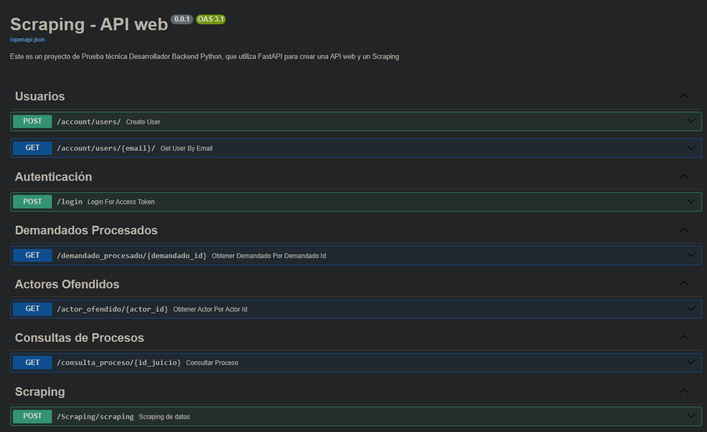
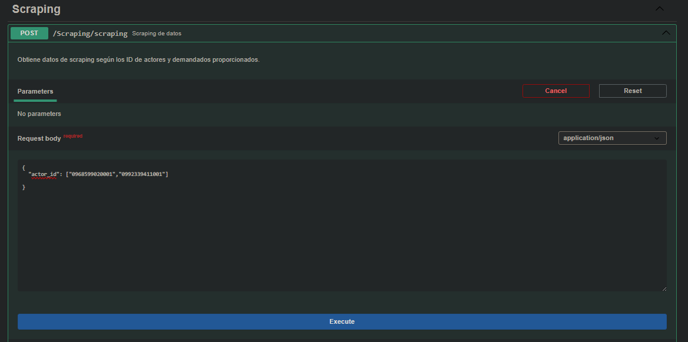
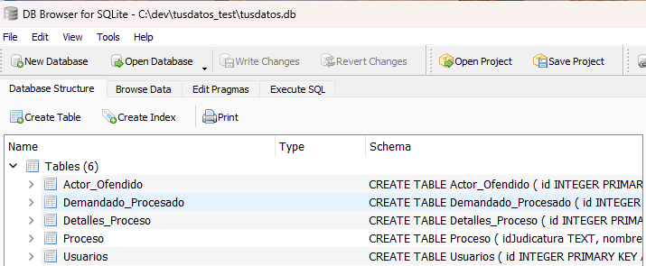
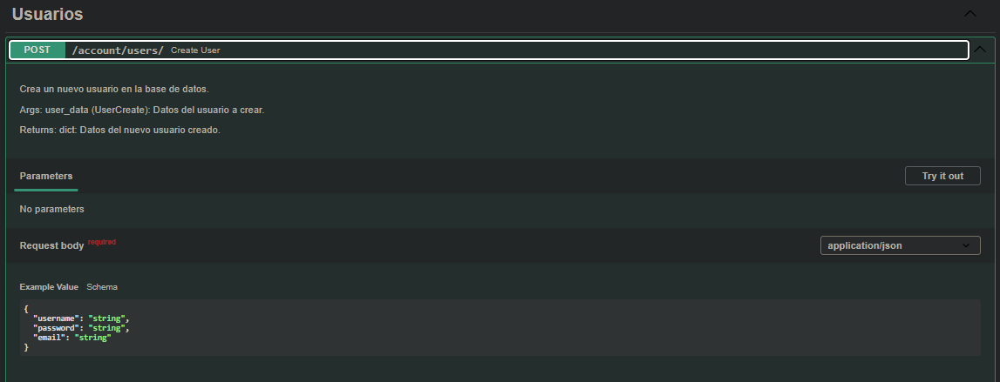
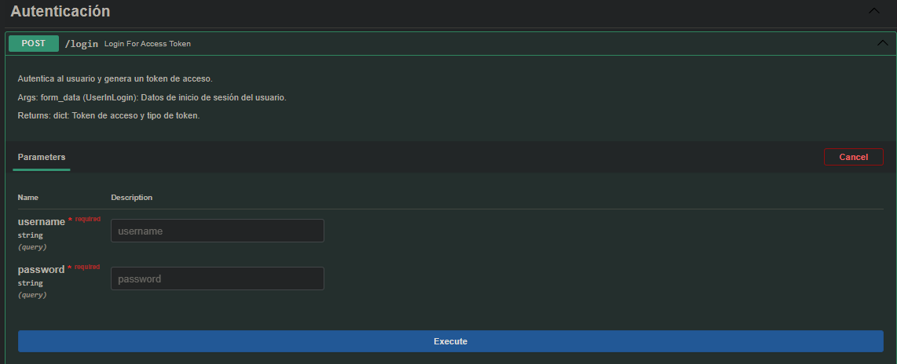
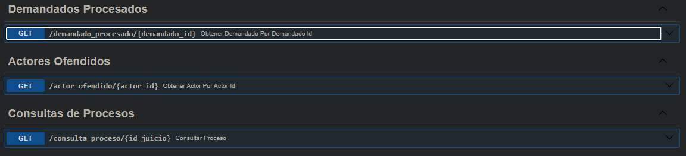

# FastAPI Project

Este es un proyecto de Prueba técnica Desarrollador Backend Python,
 que utiliza FastAPI para crear una API web y un Scraping. los datos octenidos son de https://procesosjudiciales.funcionjudicial.gob.ec/expel-busqueda-avanzada

## Requisitos

- Python >= 3.7
- Pip (administrador de paquetes de Python)
- SQLite

## Instalación

1. Clona el repositorio desde GitHub:

```bash
git clone https://github.com/Dimaps716/tusdatos_test.git
```

2. Navega al directorio del proyecto:

```bash
cd tu_proyecto
```

3. Instala las dependencias del proyecto:

```bash
pip install -r requirements.txt
```

## Configuración

1. Crea un archivo `.env` en el directorio raíz del proyecto y configura las variables de entorno necesarias. Puedes encontrar un ejemplo de las variables requeridas en el archivo `.env.example`.

## Ejecución

Una vez que hayas clonado el repositorio, instalado las dependencias y configurado las variables de entorno, puedes ejecutar el proyecto:

```bash
uvicorn app.main:app --reload
```

Esto iniciará el servidor de desarrollo de FastAPI y podrás acceder a la API en `http://localhost:8000/docs`.


Corrige el texto. Una vez en este punto, tendrás que ejecutar el scraping. Presiona el botón 'Try it out' y agrega los datos correspondientes. Recuerda que es una lista


Esto buscará todos los procesos asociados a esos IDs y también buscará los detalles de cada proceso en Bagraumed, y los guardará en la base de datos

Luego tendrás que crear un usuario y hacer login para obtener un token, el cual es necesario para hacer las próximas consultas


Ahora, para consultar los demás enporin, solo tienes que poner tu token y el código ID de lo que buscas. Recuerda que esta información ya está guardada en la base de datos.


#### Toma en cuenta que el código del scraping realiza múltiples peticiones a la API, por lo que puede demorar un poco en extraer la información y guardarla en la base de datos

## Contribución
Si deseas contribuir a este proyecto, por favor sigue estas pautas:

1. Haz un fork del repositorio.
2. Crea una nueva rama (`git checkout -b feature/nueva-funcionalidad`).
3. Realiza tus cambios y haz commit de los mismos (`git commit -am 'Agrega una nueva funcionalidad'`).
4. Sube tus cambios al repositorio (`git push origin feature/nueva-funcionalidad`).
5. Crea una nueva Pull Request.

## Licencia

Este proyecto está bajo la licencia [MIT](https://opensource.org/licenses/MIT).
